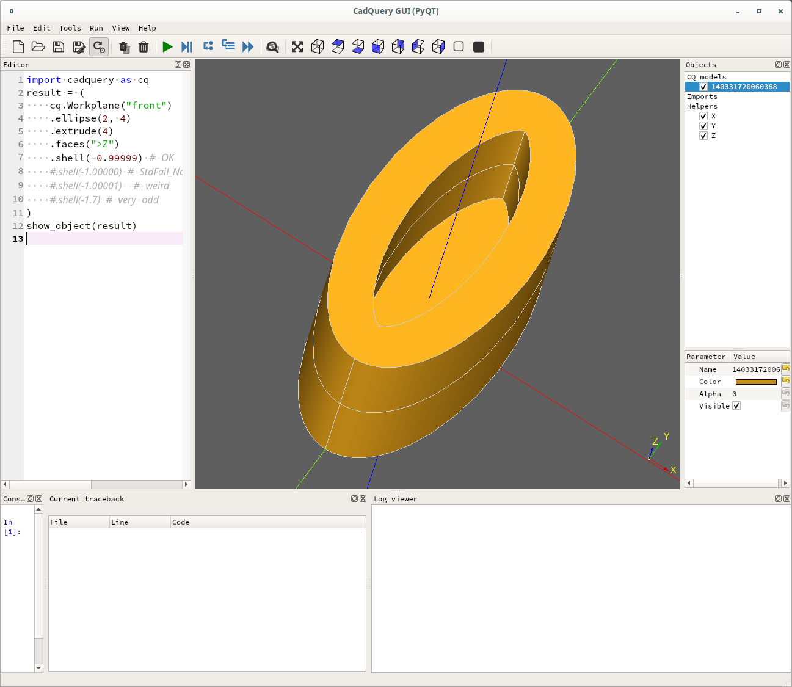
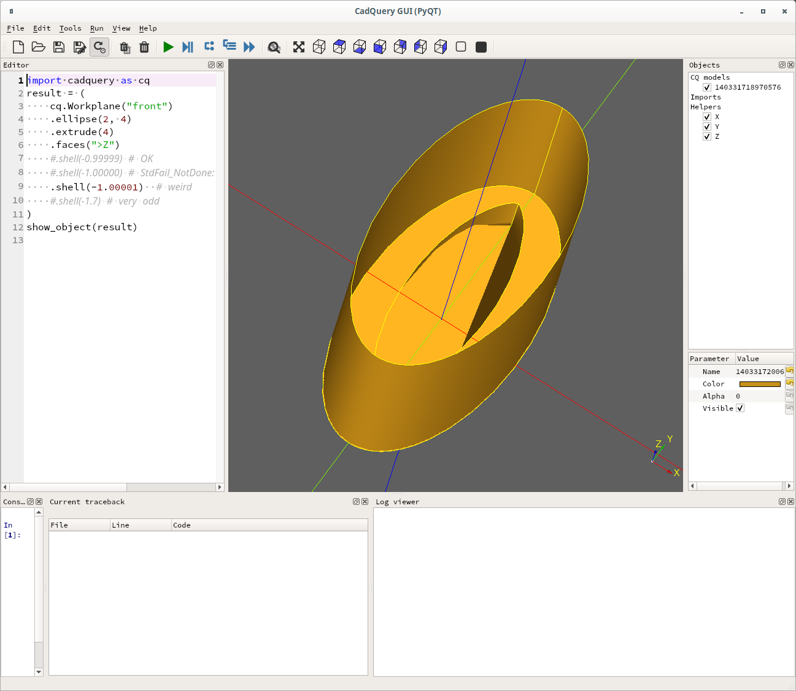
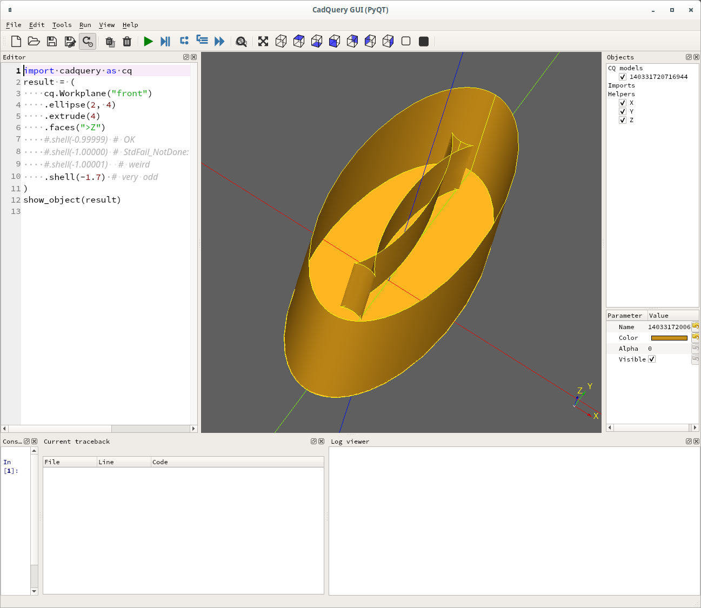

# Explore shells

The ellipitical shell rendered properly with thickness = -0.99999:
```
import cadquery as cq
result = (
    cq.Workplane("front")
    .ellipse(2, 4)
    .extrude(4)
    .faces(">Z")
    .shell(-0.99999) # OK
    #.shell(-1.00000) # StdFail_NotDone: BRep_API: command not done
    #.shell(-1.00001)  # weird
    #.shell(-1.7) # very odd
)
show_object(result)
```

Screenshot of cq-editor for thickness = -0.99999 above:


With thickness = -1.00000 we get `StdFail_NotDone` error:
```
import cadquery as cq
result = (
    cq.Workplane("front")
    .ellipse(2, 4)
    .extrude(4)
    .faces(">Z")
    #.shell(-0.99999) # OK
    .shell(-1.00000) # StdFail_NotDone: BRep_API: command not done
    #.shell(-1.00001)  # weird
    #.shell(-1.7) # very odd
)
show_object(result)
```
Screenshot for thickness = -1.00000 above NOTICE the Red error message in Current tracback:


With thickness = -1.00001 we get a weird result:
```
import cadquery as cq
result = (
    cq.Workplane("front")
    .ellipse(2, 4)
    .extrude(4)
    .faces(">Z")
    #.shell(-0.99999) # OK
    #.shell(-1.00000) # StdFail_NotDone: BRep_API: command not done
    .shell(-1.00001)  # weird
    #.shell(-1.7) # very odd
)
show_object(result)
```
Screenshot for thickness = -1.00001 above:



With thickness = -1.7 we get a very odd result:
```
import cadquery as cq
result = (
    cq.Workplane("front")
    .ellipse(2, 4)
    .extrude(4)
    .faces(">Z")
    #.shell(-0.99999) # OK
    #.shell(-1.00000) # StdFail_NotDone: BRep_API: command not done
    #.shell(-1.00001)  # weird
    .shell(-1.7) # very odd
)
show_object(result)
```
Screenshot for thickness = -1.00001 above:

